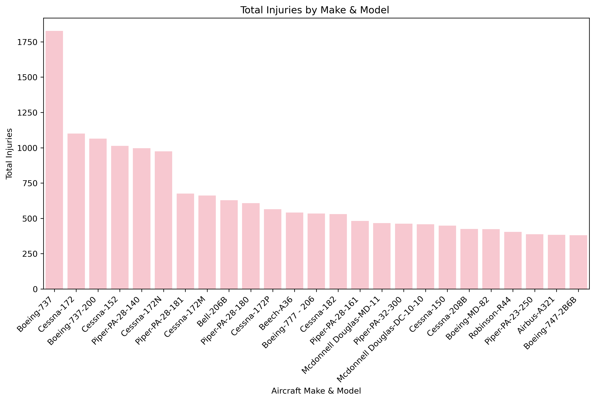

# Aviation Accident Risk Analysis

## Overview

This project analyzes aviation accident data from the National Transportation Safety Board (NTSB), covering incidents from 1962 to 2023.

The goal is to identify low-risk aircraft models to support our company's expansion into the aviation industry. The analysis involves data cleaning, imputation, visualization, and business intelligence insights to guide decision-making.
## Business Understanding

The stakeholders in this analysis include airline companies, aviation safety regulators, aircraft manufacturers, and insurance companies.

Key Business questions:
1. What are the key risk factors leading to injuries and fatalities?
2. What changes can be made to improve aviation safety?
## Data Understanding

 The dataset used is from the National Transportation Safety Board(NTSB) and has aviation data from the year 1962 to 2023.

**The three features highly focused on in this project are:** 
1. Aircraft model 
2. Aircraft category
3. Aircfat make
4. Event date
.

## Data Analysis and Visualization

Focusing on the chosen features (Event date, aircraft model, make and category) to analyse and visualize the data.
 
 1. Injury Trends over Time

From the figure above, it is evident that there were few injuries upto the year 1981, where we see a rise in injuries in 1982. There was a gradual drop until 1996 were there is a spike with 3794 injuries. There after, we see a decrease in the number of injuries which can be attributed to measures put in place to curb accidents.

2. Injuries by Category

 
From the above, we see that Airplane and Helicopter are leading interms of total number of Injuries. Categories such powered-lift and Blimp have almost zero registered injuries.

3. Injuries by Aircraft Make

From the visualization above, Cessna, Boeing and Piper have a high number of total injuries.

4. Injury by Make & model

From this figure, Boeing 737 has the highest number of injuries, followed by Cessna172. Boeing 777-206, Airbus-A321 are also among the top leading models in-terms of injuries.

5. Tableau Dashboard

A dashboard is build for this, explore it [here](https://public.tableau.com/app/profile/lucy.mutua/viz/AviationAccidentRiskAnalysis_17431941135170/AviationAccidents)

## Conclusion

### Findings and Recommendations

Writing down the findings from the visualizations and analysis. 
Giving recommendations based on the findings.

**Finding 1:** Injuries have significantlly decreased over Time.

**Recommendation:** The company should have pilot training programs, aircraft maintenance training as well as choose aircrafts with established safety procedures.

**Finding 2:** Aircraft Category Plays a Major Role in Safety.

**Recommendation:** The company should select models with improved safety records, cutting-edge safety measures, and reduced accident rates.

**Finding 3:** Aircraft Make Influences Safety Performance.

**Recommendation:** The company should focus on aircraft manufacturers with strong safety records and lower historical injury counts.

